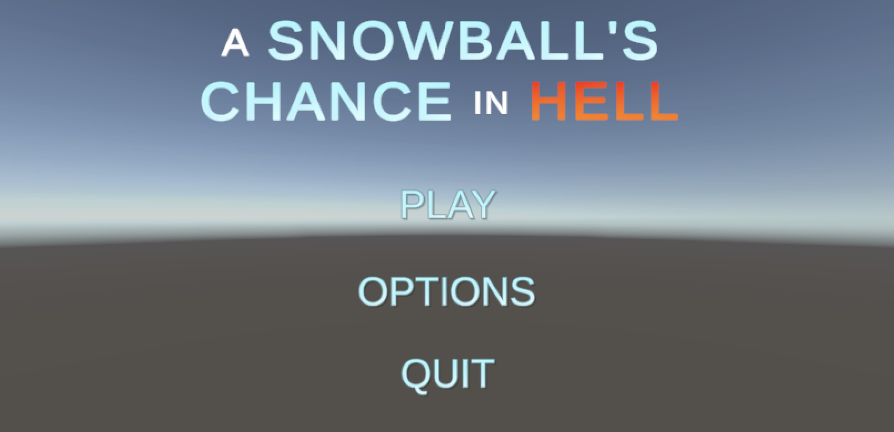
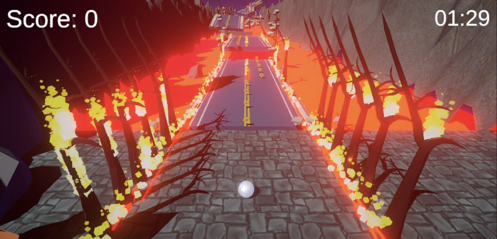

# A Snowball's Chance In Hell

<html>

</html>

_By [Ian Bravo](https://github.com/ian-bravo), [Jonathan Cheng](https://github.com/joncheng-dev), [Onur Kaymak](https://github.com/onurkaymak), [Richard Barbour](https://github.com/rbarcode), & [Jeremy Josol](https://github.com/jeremyjosol)_.

[Click to play!](https://jeremyjosol.github.io/ASnowballsChanceInHell/)

## About
Embark on a remarkable journey as a resilient Snowball in the scorching depths of Hell, where every moment is a test of determination and willpower. Our intrepid hero, the Snowball, faces impossible challenges and seemingly insurmountable odds, a reflection of life's adversities. In this gripping adventure, the Snowball strives to make the impossible _possible_.

Every action shapes the Snowball's destiny, making it more than just a test of skill but a test of your empathy. Can you guide the Snowball to safety and help it defy the odds against it? The answer lies in your hands in this thrilling adventure of resilience and the triumph of the will to survive.

## Technologies Used

* _Github_
* _VSCode/Visual Studio_
* _C#_
* _Unity_
* _Blender_

### Gameplay
You, the player, take on the role of the Snowball GameObject, and in this story of courage and tenacity, the Snowball reacts to your input with unwavering resolve. By applying directional forces, you guide the Snowball through a world engulfed in flames, where danger lurks at every corner.

<html>

</html>

> #### Controls

| Key  | Action        |   Description |
| ----------- | ----------- |  -----------  |
|   ↑	`Up Arrow`     | Go Forward     | _Move Player GameObject forward_  |
|   ←  `Left Arrow`     | Go Left      | _Move Player GameObject to the left_ |
|   ↓	 `Down Arrow` | Go Backward      | _Move Player GameObject backward_ |
|   →	  `Right Arrow` | Go Right      | _Move Player GameObject to the right visitors_ |
|  ␣  `Spacebar`  | Jump      |  _Make Player GameObject jump_ |

> ##### Alternative Controls

| Key | Action       |
| --- | ------------ |
| `W`   | Go Forward   |
| `A`   | Go Left      |
| `S`   | Go Backward  |
| `D`   | Go Right     |

> #### Features and Mechanics

* The Player's speed is finely tuned to deliver a balanced yet thrilling experience.

* All vessels in the game world are responsive to collisions, allowing for dynamic interactions.

* Incrementable score display to keep track of performance.

* Various GameObjects that provide either a speed boost or slowdown.

* Beat the clock to make it to a safer destination without completely melting.

* Sound effects and background music.

* Win or lose conditions.

---

<html>

</html>

  > _Powered by Unity_

---

### Credits and Acknowledgements

> #### Assets

* [Stone](https://assetstore.unity.com/packages/2d/textures-materials/floors/hand-painted-stone-texture-73949)
* [Terrain](https://assetstore.unity.com/packages/3d/environments/landscapes/terrain-sample-asset-pack-145808)
* [Snowball](https://3dtextures.me/2018/02/27/snow-002/)
* [Snow and Ice](https://ylemish.gumroad.com/l/ylem-snow_and_ice)
* [Snow Forest](https://assetstore.unity.com/packages/3d/environments/landscapes/stylized-snow-forest-230653)
* [Winter Village](https://assetstore.unity.com/packages/3d/environments/landscapes/flatpoly-winter-village-51544)
* [Rope Bridge](https://assetstore.unity.com/packages/3d/environments/rope-bridge-3d-222563)
* [Low Poly Fire](https://assetstore.unity.com/packages/vfx/particles/fire-explosions/low-poly-fire-244190)
* [Metallic Coin](https://assetstore.unity.com/packages/3d/props/metallic-coin-free-trial-241879)
* [Score and Time](https://assetstore.unity.com/packages/audio/sound-fx/score-and-time-59255)


> #### Music
- **Artist:** Aphex Twin
- **Album:** Drukqs
- **Songs:** 
  - Bbydhyonchord
  - Vordhosbn

### Known Bugs
...Bugs? They're features! 😉

### ⚖️ License

This project is licensed under the [MIT License](https://opensource.org/licenses/MIT). Copyright (C) 2023 _Ian Bravo, Jonathan Cheng, Onur Kaymak, Richard Barbour, & Jeremy Josol_. All Rights Reserved.

```
MIT License

Copyright (c) 2023 Ian Bravo, Jonathan Cheng, Onur Kaymak, Richard Barbour, & Jeremy Josol.

Permission is hereby granted, free of charge, to any person obtaining a copy
of this software and associated documentation files (the "Software"), to deal
in the Software without restriction, including without limitation the rights
to use, copy, modify, merge, publish, distribute, sublicense, and/or sell
copies of the Software, and to permit persons to whom the Software is
furnished to do so, subject to the following conditions:

The above copyright notice and this permission notice shall be included in all
copies or substantial portions of the Software.

THE SOFTWARE IS PROVIDED "AS IS", WITHOUT WARRANTY OF ANY KIND, EXPRESS OR
IMPLIED, INCLUDING BUT NOT LIMITED TO THE WARRANTIES OF MERCHANTABILITY,
FITNESS FOR A PARTICULAR PURPOSE AND NONINFRINGEMENT. IN NO EVENT SHALL THE
AUTHORS OR COPYRIGHT HOLDERS BE LIABLE FOR ANY CLAIM, DAMAGES OR OTHER
LIABILITY, WHETHER IN AN ACTION OF CONTRACT, TORT OR OTHERWISE, ARISING FROM,
OUT OF OR IN CONNECTION WITH THE SOFTWARE OR THE USE OR OTHER DEALINGS IN THE
SOFTWARE.
```